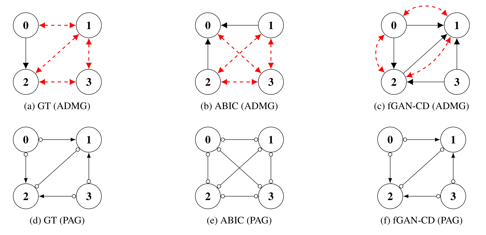

# fgan-Causal-Discovery
# Generative Causal Discovery with Unmeasured Confounding via Bayesian f-GAN

 

> **Note:** The full manuscript is currently under review. You can download the preprint [here](./fgancd.pdf).

## 📖 Abstract

Causal discovery from observational data is challenging, especially in the presence of **unmeasured confounding**. Traditional score such as BIC can be problematic for singular models like ADMGs. We use **Bayes Free Energy** instead.

This project proposes a novel **Bayesian framework** that:
1.  **Marginalizes over weights** using a stochastic generator, focusing purely on learning the binary structure .
2.  Minimizes the **Bayes Free Energy** via variational **f-divergence** minimization.
3.  Utilizes **Gumbel-Softmax** for differentiable discrete structure search within an adversarial (f-GAN) training loop.

## 🚀 Key Method

### 1. From Bayes Free Energy to f-GAN

In regular statistical models, the Bayesian Information Criterion (BIC) approximates the model evidence well. However, causal models with hidden variables are **singular**. So we aim to directly minimize the negative logarithm of the model evidence, that is, the Bayesian free energy:

  

Our method bridges **Bayesian Model Selection** and **GANs**:

  

 

 is the binary graph structure we want. We aim to minimize the Bayes Free Energy, which is equivalent to minimizing the KL divergence between the true data distribution and the model's marginal distribution. 

KL divergence is a special case of f-divergence, when the generating function .

* **Variational Lower Bound**: According to the f-GAN framework, f-divergence has a variational lower bound:

  

* : The distribution of the real data.

* : The distribution of the model generated by the generator.

* : The variational function (served by the **discriminator** neural network).

* : The conjugate function of .

By leveraging the **f-GAN framework** [Nowozin et al., 2016], we transform this into a min-max optimization problem:

  

### 2. Generative Process with Weight Marginalization

Our generator does not learn fixed weights. Instead, it learns the binary structure of the graph. However, since the discrete structure parameters are not differentiable, the generator instead takes two logits matrices, which indicate the **probability of edges**, as parameters. We then use the Gumbel-Softmax trick to get soft proxies of binary structure from the logits. During training, weights are sampled from a prior distribution  to simulate the marginal likelihood integral.

The model distribution generation process is as follows:

1. **Structure Sampling**: Use Gumbel-Softmax to sample differentiable proxies of the binary matrices  from Logits.

2. **Parameter Prior Sampling**: Randomly sample specific weights  from a uniform distribution (this corresponds to the parameter integration in the model likelihood).

3. **Masking**: Use  to select edges with weights. 

4. **Data Generation**: Generate  using the linear SEM model .

## 🧪 Experiments (Proof of Concept)

We evaluated the method on synthetic datasets with linear SEMs and unmeasured confounding.We compared fGAN-CD against state-of-the-art differentiable method ABIC

### Case study A
| Method | SHD $\downarrow$ | Skeleton F1 $\uparrow$ | Arrowhead F1 $\uparrow$ |
| :--- | :---: | :---: | :---: |
| ABIC (Baseline) | 3.40 | 0.897 | 0.100 |
| **fGAN-CD (Ours)** | **2.17** | **0.909** | **0.667** |

### Independence Test
We designed a high confounding scenario with ground truth: Directed edges $D = [(0,2)]$ and Bidirected edges $B = [(0,1),(1,2),(1,3),(2,3)]$.  

In the ground truth graph, Node $0$ and Node $3$ are d-separated. So there should be no edges in the PAGs of the learned graphs. We use this as a sanity check.
As shown in Figure 1, the baseline ABIC incorrectly inferred a connection between nodes 0 and 3. The fGAN-CD method, however, correctly identifies that no edge exists between nodes 0 and 3 and recovers the true PAG.

*See the [Full Paper](./fganxd.pdf) for detailed experimental setup and results.*
